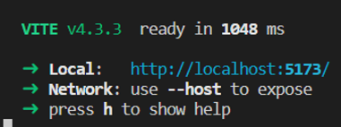
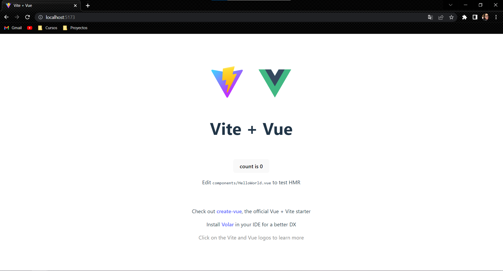
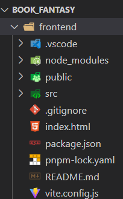
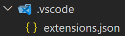
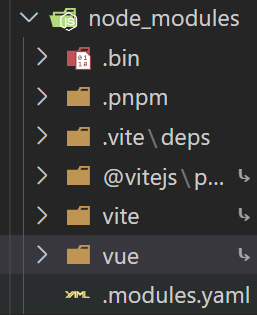
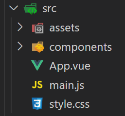
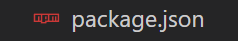
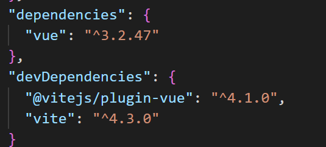
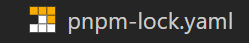
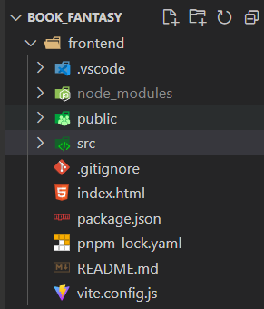

# Documentación sobre el proyecto de book_fantasy

En ese proyecto es sobre una librería virtual realizada con Vue.js, framework de JavaScript, utlizando la librería vite en la parte del frontend y con Node.js Framework de JavaScript y la librería de Express, a continuación documentaremos el paso a paso, desde que debemos instalar y como crear nuestro proyecto desde el lado del frontend.


## Primero repasaremos los siguientes conceptos:

**Node.js:** es un entorno de ejecución(Donde se prepara un proyecto y se corre) de JavaScript que se utiliza para crear aplicaciones de red y del lado del servidor.

    1. Es un entorno controlado por eventos que permite establecer y gestionar múltiples conexiones de forma eficiente.

    2. Node.js es una tecnología del back-end e intérprete de JavaScript que permite ejecutar código en el servidor.

    3. Con Node.js, se pueden crear sitios web dinámicos muy eficientes escritos con el lenguaje de programación JavaScript.

    4. En resumen, Node.js es una herramienta que permite a los desarrolladores crear aplicaciones escalables y eficientes en el lado del servidor usando JavaScript.

**PNPM:** es una variante de NPM ( Node Package Manager) que también se utiliza para la gestión de paquetes de Node.js.

    1. Al igual que NPM, PNPM se utiliza para instalar y administrar paquetes de Node.js, pero con algunas diferencias en la forma en quese manejan las dependencias. PNPM utiliza un enfoque de almacenamiento compartido, lo que significa que los paquetes se almacenan en un solo lugar en el disco y se comparten entre los proyectos, lo que puede ahorrar espacio en el disco y reducir el tiempo de instalación de paquetes.

    2. En resumen, PNPM es una alternativa a NPM que puede ser útil para proyectos que requieren la instalación de muchos paquetes de Node.js.

**VITE:** 

"Vite" es una herramienta de compilación que tiene como objetivo proporcionar una experiencia de desarrollo más rápida y ágil para proyectos.

**Vite** es una herramienta,  generador del proyecto y que nos ayuda a compilar.

**PAQUETE:**

Son las dependencias que se necesitan para ejecutar un proyecto.


### Ahora explicaremos como instalar cada una de las app

- Instalar nodejs
    - Buscamos la página oficial, en este caso [https://nodejs.org/es](https://nodejs.org/es), descargamos según la versión que vayamos a utilizar y el sistema operativo de nuestra preferencia.
    - Se siguen los pasos que se propone el instalador y al finalizar el nos notificará que la instalación se completó satisfactoriamente.
- Instalar pnpm
    - Vamos a su página principal, nos dirigimos a esta ruta  [https://pnpm.io/es/installation](https://pnpm.io/es/installation).
    - Escogemos la forma de descarga que más se ajuste al dispositivo.
    - Luego te diriges a la consola de comandos de tu preferencia.
    - Comprobamos que efectivamente Node.js esté instalado y su versión, con el siguiente comando.
    
        ```markdown
        node -v
        ```
    
    - Ejecutar el comando de instalación: Se debe ejecutar el siguiente comando en la terminal:
        ```markdown
        `npm install -g pnpm`
        ```
        Este comando se instalará globalmente en el sistema.
        
    - Verificar la instalación: Para verificar que **pnpm**se ha instalado correctamente, se puede ejecutar el siguiente comando en la terminal:
        ```markdown
        `pnpm -v`
         ```
        Este comando debería mostrar la versión de que se ha instalado.
        
    
        Con estos pasos, se habrá instalado **pnpm** en el sistema y se podrá utilizar para administrar paquetes de Node.js de manera más eficiente que con **npm**.


## Creación de nuestro proyecto


1. Vamos a crear una carpeta con el nombre del proyecto, en mi caso la crearé en el escritorio. 
2. La arrastramos hacia Visual Studio Code, que será en este caso el IDE que utilizaremos para el proyecto.
3. Ahora abrimos la terminal de VSC y colocamos el comando, 
    ```markdown
    `pnpm create vite frontend --template vue`
     ``` 
     en este caso **frontend** es el **nombre del proyecto** y luego le damos enter para ejecutar el comando.
    
4. La terminal nos indicará  como debemos correr el proyecto.
5. Para eso  colocamos el comando 
    ```markdown
    `cd frontend`
    ```
    y enter para ejecutar el comando.
6. Luego el comando 
    ```markdown
    `pnpm install`
    ``` 
    para hacer la instalación de las dependecias del proyecto.

7. También 
    ```markdown
    `pnpm run dev`
    ``` 
    para levantar el servidor y correr el proyecto.
8. Al terminar nos va a salir algo como esto. 



9. Copiamos el link del localhost y lo pegamos en nuestro navegador de preferencia y si aparece la siguiente imagen, es porque ya levantamos el servicio local.



10. Felicidades tienes un nuevo proyecto en Vue con Vite.


## Explicación del encarpetado que provee el framework




**Nombre del proyecto**


**Carpeta de Visual Studio Code**  Donde están las extenciones que necesita el editor y para que sepa qué hace el framework.




**node_modules** Es una carpeta que se utiliza en proyectos de Node.js para almacenar todas las dependencias y paquetes que se utilizan en el proyecto.

Cuando se instala un paquete en un proyecto de Node.js utilizando el manejador de paquetes npm, el paquete se descarga y se guarda en la carpetadel proyecto.

La carpeta es importante porque permite que los proyectos de Node.js tengan acceso a las dependencias y paquetes necesarios para funcionar correctamente. Cuando se ejecuta un proyecto de Node.js, Node.js busca las dependencias y los paquetes necesarios en la carpeta del proyecto.

Es importante tener en cuenta que la carpeta puede ser muy grande, especialmente en proyectos grandes con muchas dependencias. Por lo tanto, es común que los desarrolladores eliminen la carpeta y la vuelvan a crear utilizando el comando cuando sea necesario.

También es posible que se ignore la carpeta en el control de versiones del proyecto para evitar subir archivos necesarios al repositorio.



La carpeta **public** es una carpeta diseñada para compartir información con otras personas en un grupo de trabajo u organización.

Es una forma facil y efectiva de obtener, organizar y compartir informacion. En algunos casos, como en Dropbox, se pueden crear vínculos públicos para compartir archivos. En Windows 10, la carpeta pública se utiliza para recopilar, organizar y compartir información con otros usuarios de la misma computadora. En resumen, la carpeta pública sirve para compartir información y archivos con otros usuarios de manera fácil y efectiva.


La carpeta **src** es una convención utilizada en proyectos de programación para almacenar el código fuente del proyecto. La carpeta **src** es una abreviatura de "source" (fuente en inglés) y se utiliza para distinguir el código fuente de otros archivos, como archivos de configuración, archivos de recursos y archivos de bibliotecas.

En resumen, la carpeta **src** es una convención utilizada para almacenar el código fuente de un proyecto de programación.



El archivo **.gitignore** es un archivo de texto que se utiliza en Git para indicar qué archivos o carpetas deben ser ignorados por el control de versiones . Esto significa que los archivos o carpetas especificadas en el archivo **.gitignore** no serán rastreados por Git y no se seguirán en los commits.

En git no subirá archivos que no tiene en cuenta, se ahorra espacio de almacenamiento.


**index.html** es la carpeta principal que todo proyecto web necesita para correr. 


**package.json** es un archivo que nos da la configuaración y las dependencias (Es la instalación de algo) necesarias para utilzar en el proyecto. Las dependencias, son obligatorias para que el proyecto funcione.



**dependencies:** Cuando se compila la utiliza, sirve para ejecutar el proyecto.

**devDependencies:** Para mejorar dependencia de desarrollo



En resumen, **pnpm-lock.yaml** es un archivo de bloqueo generado por el **pnpm** administrador de paquetes que enumera la versión exacta de cada paquete instalado y sus dependencias, lo que garantiza que se instalen las mismas versiones de paquetes en diferentes máquinas o entornos.



El archivo **README.md** se escribe en formato Markdown, que es un lenguaje de marcado que permite agregar formato al texto, como encabezados, listas, enlaces, imágenes y código. El formato Markdown es fácil de leer y escribir en comparación con el HTML, que es otro lenguaje de marcado.

El archivo **README.md** es importante porque proporciona información esencial sobre el proyecto a los usuarios y desarrolladores. Ayuda a los usuarios a comprender el propósito del proyecto, cómo instalarlo y cómo utilizarlo. También ayuda a los desarrolladores a contribuir al proyecto necesitará información sobre cómo configurar el entorno de desarrollo, cómo ejecutar pruebas y cómo enviar solicitudes de extracción.


El archivo **vite.config.js** es un archivo de configuración de Vite , un servidor de desarrollo web que se utiliza para construir aplicaciones web modernas en JavaScript . Este archivo se utiliza para personalizar la configuración de Vite y ajustar su comportamiento según las necesidades del proyecto.


### Definir la estructura de carpetas del proyecto

Ya teniendo una idea de como crear el proyecto, ahora vamos a definir la estructura de las carpetas del mismo, en nuestro caso lo hicimos de la siguiente manera, teniendo en cuenta que queremos manejar frontend y backend en diferentes carpetas, para que tanto el frontend como el backend, queden desacoplados (que no dependan) uno del otro y sean totalmente independientes.

